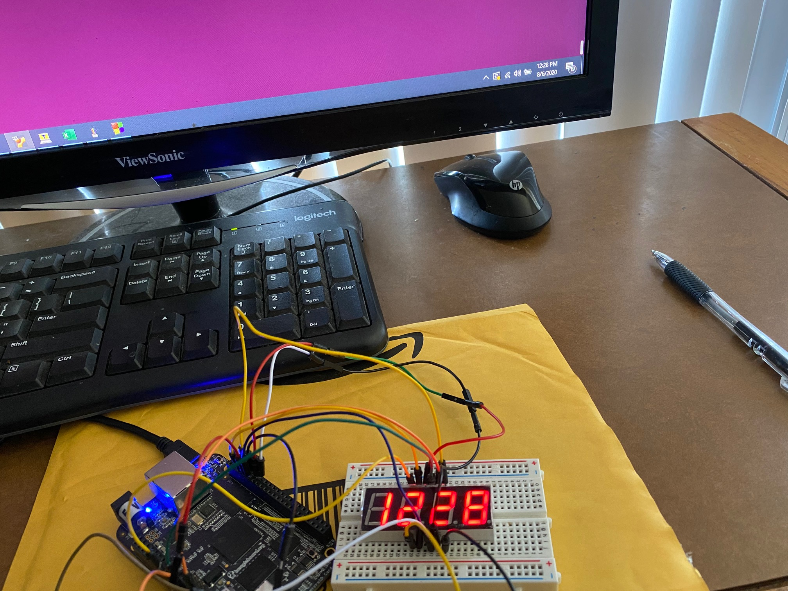

# 7seg_Driver_BBB
7 segment display drivers for Beagle Bone Black

To use this in your project:  
Step1: Do the pin connections according the table in SevenSeg_Driver.h file   
Step2: Copy the SharathBBB_Drivers folder into your project and add it to the compiler includes  
Step3: Use the source code in src folder for digital clock application  
Step4: compile code  
**Note: Once compiled run the code in sudo mode, and my first run always gave file error and the second run always gave output.Dont know why :)   

Output for Digital clock application

